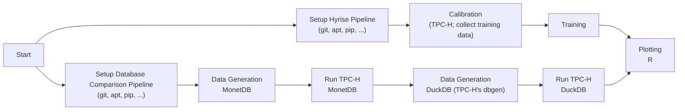

# Automated Encoding Selection
### Reproducibility Repository

This repository contains source code and artifacts for the paper **Robust and Budget-Constrained Encoding Configurations for In-Memory Database Systems** (VLDB 2022).

In case you have any questions, please contact [Martin Boissier](https://hpi.de/plattner/people/phd-students/martin-boissier.html).

## Setup - Overview

This project consists of three main components: (i) Hyrise, (ii) the encoding plugin for Hyrise, and (iii) Python scripts that train the models and run the actual selection process.
The repository contains the `encoding_plugin` directory, which stores a (actually a set of) plugin(s). These plugins for Hyrise manage the communication with the Hyrise server. Hyrise itself is a third party module within the plugin.
The Python code is stored in the `python` directory.

## Setup - Execution

The whole encoding selection pipeline runs within GitHub actions to make it as easy as possible to reproduce the results and run everything on your own machines (e.g., using [act](https://github.com/nektos/act)).
Due to GitHub restrictions, the pipeline creates only a tiny data set (scale factor of 0.5).

For each run, we compare Hyrise against MonetDB and DuckDB.
The results are plotted and stored in the artifacts of each run.
Please note that we compare against DuckDB more or less for fun.
We are huge fans of the project, but the current benchmark script is probably an unfair comparison (multiple concurrent clients).
We have talked to the DuckDB maintainers and decided to exclude DuckDB measurements from the paper for this reason.
In case you can help us to make a fair comparison, feel free to post a pull request.

The code (both the plugins as well as the Python scripts) are extracted from a larger project.
Please excuse the often convoluted and bloated code.

