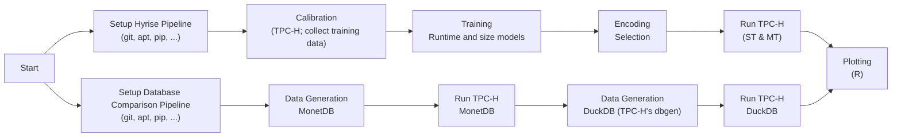

# Automated Encoding Selection
### Reproducibility Repository

This repository contains source code and artifacts for the paper [**Robust and Budget-Constrained Encoding Configurations for In-Memory Database Systems**](https://www.vldb.org/pvldb/vol15/p780-boissier.pdf) (VLDB 2022).


Once a month, we automatically execute the encoding system presented in the paper as a GitHub action and compare the performance against MonetDB and DuckDB[^1].
You can see the most recent results plotted in the `database_comparison.zip` artifact of the [most recent run of the main branch](https://github.com/hyrise/encoding_selection/actions?query=branch%3Amain) (more information below).


In case you have any questions, please contact [Martin Boissier](https://hpi.de/plattner/people/phd-students/martin-boissier.html).


### Citation

Shortened DBLP BibTeX entry:
```bibtex
@article{DBLP:journals/pvldb/Boissier21,
  author    = {Martin Boissier},
  title     = {Robust and Budget-Constrained Encoding Configurations for In-Memory
               Database Systems},
  journal   = {Proc. {VLDB} Endow.},
  volume    = {15},
  number    = {4},
  pages     = {780--793},
  year      = {2021},
  url       = {https://www.vldb.org/pvldb/vol15/p780-boissier.pdf},
  doi       = {10.14778/3503585.3503588}
}
```


## Setup - Overview

This project consists of three main components: **(i)** Hyrise, **(ii)** the encoding plugin(s) for Hyrise, and **(iii)** Python scripts that train the models and run the actual selection process.
The repository contains the `encoding_plugin` directory, which stores a (actually a set of) plugin(s). These plugins for Hyrise manage the communication with the Hyrise server. Hyrise itself is a third party module within the plugin.
The Python code is stored in the `python` directory.


## Setup - Execution

[](https://github.com/hyrise/encoding_selection/actions/workflows/haupt.yml)

The whole encoding selection pipeline runs within GitHub actions to ease reproducing the paper's results or run everything on your own machines (e.g., using [act](https://github.com/nektos/act)).
The `hyrise_full_pipeline` job in the main workflow file [haupt.yml](https://github.com/hyrise/encoding_selection/blob/main/.github/workflows/haupt.yml#L20) lists all steps required from gathering calibration data, learning models, selecting configurations, to evaluating them.
Due to GitHub restrictions, the pipeline creates only a tiny data set (scale factor of 0.5).

For each run, we compare Hyrise against MonetDB and DuckDB[^2].
The results are plotted and stored in the artifacts of each run[^3].
Download `database_comparison(.zip)` of the last succesful run for a plot of the TPC-H benchmark runs.


The code (both the plugins as well as the Python scripts) are extracted from a larger project.
Please excuse the often convoluted and bloated code.

Flowchart of the GitHub runner workflow:


[^1]: Please note that the comparison is executed on GitHub action runners and is thus only meant to show reproducibility. We do not aim to establish a performance order with these action runs.

[^2]: Please view the results with a huge grain of salt, especially the DuckDB results.
We are huge fans of DuckDB and thus wanted to include it.
But the current benchmark script is probably an unfair comparison, as DuckDB's aim is more on single-user performance (i.e., data scientists/smartists).
Hyrise's focus on concurrent OLTP/OLAP users.
In a single-user-multiple-cores scenario, DuckDB performs significantly better.
Further, we cannot rule out that Python's GIL causes unexpected performance degradations.
We have talked to the DuckDB maintainers and decided to exclude DuckDB measurements from the paper for this reason.
In case you can help us to make a fair comparison, feel free to post a pull request.

[^3]: The plots are meant to show the reproducibility of the results, not to establish a fair comparison.
To conduct a "fairer" comparison (cf. footnote on DuckDB), the pipeline needs to be run on a dedicated machine.
We have seen workflow runtimes on GitHub varying from 3h to over 6h (which is than canceled by GitHub) for the same setup.
